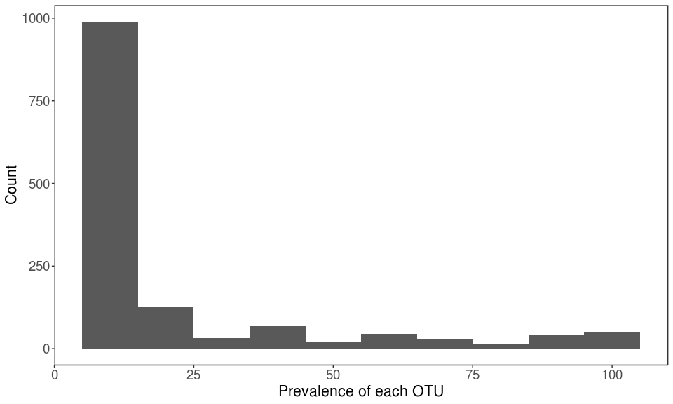

visual16S package demo
================
yeguanhua

Install dependencies
====================

Before install the visual16S, there are some packages needed to be manually install from Bioconductor.

``` r
if (!requireNamespace("BiocManager", quietly = TRUE)) install.packages("BiocManager")
BiocManager::install(c("dada2", "phyloseq", "DESeq2", "EnhancedVolcano"))
```

Install and load package
========================

Note:

You need to run install from the parent working directory that contains the visual16S folder.

``` r
devtools::install('visual16S')
```

#### If you can't install package in R Console, try this: open visual16S.Rproj first, then use RStudio → Build → Install and Restart.

Load package and demo data.
===========================

``` r
library(visual16S)
demo_phyloseq_object <- visual16S::demo_phyloseq_object
demo_dada2_result <- visual16S::demo_dada2_result
```

Data status
===========

Primer:

CCTAYGGGRBGCASCAG ; GGACTACNNGGGTATCTAAT

DADA2 filter parameters:

dada2::filterAndTrim(truncLen=c(0,0), maxEE=c(2,2))

DADA2 taxonomy database:

silva\_nr\_v132

Metadata:

| SampleID  | diagnosis         |
|:----------|:------------------|
| s17118657 | healthy           |
| s17118661 | healthy           |
| s17118667 | healthy           |
| s17118714 | healthy           |
| s17118646 | intestinal cancer |
| s17118664 | intestinal cancer |
| s17118669 | intestinal cancer |
| s17118686 | intestinal cancer |
| s17118647 | liver cancer      |
| s17118684 | liver cancer      |
| s17118715 | liver cancer      |
| s17118730 | liver cancer      |
| s17118650 | lung cancer       |
| s17118680 | lung cancer       |
| s17118691 | lung cancer       |
| s17118703 | lung cancer       |

DADA2 workflow reads track
==========================

First use the track\_reads\_dada2 function to check reads drop associated with every step in DADA2.

Note:

You can plot reads track in either absolute abundance or relative abundance.

If the sample size is too large to show on legend, set legend\_position to "none".

``` r
track_reads_dada2(demo_dada2_result$reads_track, 
                  single_end = FALSE, 
                  relative_abundance = TRUE, 
                  legend_position = "top")
```


Plot sparsity - plot\_sparsity()
================================

``` r
plot_sparsity(demo_dada2_result$seq_tab, binwidth = 10)
```



Stacked barplot of phylogenetic composition - plot\_stacked\_bar()
==================================================================

Use plot\_stacked\_bar function to plot the taxonomy level abundance in every sample. You can change the 'level' argument to plot abundance in different level, or change the 'feature' to choose different feature you want to show in x-axis.

### Minimum usage

``` r
plot_stacked_bar(phyloseq = demo_phyloseq_object, 
                 level = "Class")
```


### Plot in relative abundance

``` r
plot_stacked_bar(phyloseq = demo_phyloseq_object, 
                 level = "Class", 
                 relative_abundance = TRUE)
```


### Set "feature" parameter to show feature information

``` r
plot_stacked_bar(phyloseq = demo_phyloseq_object, 
                 level = "Class", 
                 relative_abundance = TRUE, 
                 feature = "diagnosis")
```


### Pass ordered sample names to "order" parameter to plot in specific order

``` r
sample_order <- extract_metadata_phyloseq(demo_phyloseq_object) %>% arrange(diagnosis) %>% .$SampleID
plot_stacked_bar(phyloseq = demo_phyloseq_object, 
                 level = "Class", 
                 relative_abundance = TRUE, 
                 feature = "diagnosis", 
                 order = sample_order)
```


Alpha diversity - plot\_alpha\_diversity()
==========================================

Use plot\_alpha\_diversity to plot alpha diversity.

### All alpha diversity

``` r
plot_alpha_diversity(phyloseq = demo_phyloseq_object, feature = "diagnosis") %>% 
  # Show result in a table in markdown
  knitr::kable()
```

| diagnosis         | samples   |  Observed|     Chao1|       ACE|   Shannon|    Simpson|  InvSimpson|    Fisher|
|:------------------|:----------|---------:|---------:|---------:|---------:|----------:|-----------:|---------:|
| healthy           | s17118657 |       256|  259.5000|  259.7298|  3.886926|  0.9528851|   21.224687|  32.61626|
| healthy           | s17118661 |       236|  238.8125|  241.4922|  3.583856|  0.9452327|   18.259087|  30.78986|
| healthy           | s17118667 |       214|  225.0000|  220.5107|  2.379044|  0.6687893|    3.019226|  27.28225|
| healthy           | s17118714 |       265|  274.0000|  269.1680|  3.405226|  0.8781308|    8.205520|  34.21672|
| intestinal cancer | s17118646 |       317|  322.0000|  321.9582|  3.840584|  0.9298637|   14.257945|  41.17106|
| intestinal cancer | s17118664 |       383|  408.0000|  398.4252|  4.615068|  0.9716829|   35.314377|  53.15833|
| intestinal cancer | s17118669 |       280|  314.0000|  288.6257|  3.642227|  0.9299103|   14.267425|  36.75522|
| intestinal cancer | s17118686 |       463|  499.9091|  479.0042|  4.765762|  0.9826985|   57.798311|  66.58539|
| liver cancer      | s17118647 |       246|  252.8750|  252.3801|  3.885810|  0.9543788|   21.919626|  32.03147|
| liver cancer      | s17118684 |       416|  426.9091|  422.5903|  4.762457|  0.9827857|   58.091385|  60.36914|
| liver cancer      | s17118715 |       325|  377.5000|  335.9106|  4.119560|  0.9571293|   23.325945|  43.60859|
| liver cancer      | s17118730 |       265|  268.7500|  269.9306|  3.901370|  0.9587435|   24.238613|  35.69064|
| lung cancer       | s17118650 |       258|  266.2727|  266.3957|  1.928436|  0.4850172|    1.941812|  33.23692|
| lung cancer       | s17118680 |       344|  359.1111|  353.7075|  4.479324|  0.9733006|   37.453969|  46.98003|
| lung cancer       | s17118691 |       197|  213.5000|  204.0969|  3.331857|  0.9208330|   12.631526|  24.27305|
| lung cancer       | s17118703 |       286|  293.2000|  289.6606|  4.050606|  0.9521931|   20.917464|  37.23602|

Or you can change 'measures' argument to use different measurement.

### Chao1

``` r
plot_alpha_diversity(phyloseq = demo_phyloseq_object, 
                     feature = "diagnosis", 
                     measures = "Chao1", 
                     p_test = "kruskal")
```

    ##      samples         diagnosis variable    value
    ## 1  s17118657           healthy    Chao1 259.5000
    ## 2  s17118661           healthy    Chao1 238.8125
    ## 3  s17118667           healthy    Chao1 225.0000
    ## 4  s17118714           healthy    Chao1 274.0000
    ## 5  s17118646 intestinal cancer    Chao1 322.0000
    ## 6  s17118664 intestinal cancer    Chao1 408.0000
    ## 7  s17118669 intestinal cancer    Chao1 314.0000
    ## 8  s17118686 intestinal cancer    Chao1 499.9091
    ## 9  s17118647      liver cancer    Chao1 252.8750
    ## 10 s17118684      liver cancer    Chao1 426.9091
    ## 11 s17118715      liver cancer    Chao1 377.5000
    ## 12 s17118730      liver cancer    Chao1 268.7500
    ## 13 s17118650       lung cancer    Chao1 266.2727
    ## 14 s17118680       lung cancer    Chao1 359.1111
    ## 15 s17118691       lung cancer    Chao1 213.5000
    ## 16 s17118703       lung cancer    Chao1 293.2000


Beta diversity - plot\_beta\_diversity()
========================================

Use plot\_beta\_diversity to plot beta diversity. Change 'method' to draw different beta diversity plot. You can locate specific sample in beta diversity plot by the table printed to the screen.

### Bray-Curtis

``` r
plot_beta_diversity(phyloseq = demo_phyloseq_object, 
                    feature = "diagnosis", 
                    method = "bray")
```

    ##     SampleID         diagnosis          PC1          PC2
    ## 1  s17118657           healthy -0.290927341  0.072252800
    ## 2  s17118661           healthy -0.307596849 -0.036986534
    ## 3  s17118667           healthy -0.212996044  0.005072186
    ## 4  s17118714           healthy  0.221843750  0.030950997
    ## 5  s17118646 intestinal cancer  0.236062504 -0.027898721
    ## 6  s17118664 intestinal cancer -0.080723593  0.126565760
    ## 7  s17118669 intestinal cancer  0.283441638 -0.026430612
    ## 8  s17118686 intestinal cancer -0.147153213  0.094026537
    ## 9  s17118647      liver cancer -0.026290448  0.190685061
    ## 10 s17118684      liver cancer -0.134091098  0.129184659
    ## 11 s17118715      liver cancer  0.118559730  0.078255342
    ## 12 s17118730      liver cancer  0.066050081 -0.240211951
    ## 13 s17118650       lung cancer -0.136990056 -0.527612428
    ## 14 s17118680       lung cancer  0.004727498  0.113546285
    ## 15 s17118691       lung cancer  0.236329177 -0.076007805
    ## 16 s17118703       lung cancer  0.169754263  0.094608425


Log2 fold change - log2fc()
===========================

Use log2fc function to show differential analysis result.

### Minimum usage

``` r
log2fc(phyloseq = demo_phyloseq_object, 
       feature = "diagnosis", 
       p_value = 0.05)
```

    ## [1] "log2 fold change (MLE): diagnosis lung.cancer vs healthy"
    ##      OTU log2FoldChange         padj
    ## 1 OTU154       22.40152 2.806171e-11
    ## 4 OTU164       21.85581 5.133843e-05
    ## 5 OTU312       20.74025 1.658810e-04
    ## 8 OTU228       19.48117 4.637397e-04
    ## 6 OTU331      -18.93621 1.699443e-04
    ## 7 OTU282      -20.06961 2.784319e-04
    ## 3 OTU109      -22.19975 1.731359e-06
    ## 2 OTU152      -25.34458 1.312528e-08


### Choose a taxonomy level to calculate log2fc.

``` r
log2fc(phyloseq = demo_phyloseq_object, 
       feature = "diagnosis", 
       p_value = 0.05, 
       level = "Genus")
```

    ## [1] "log2 fold change (MLE): diagnosis lung.cancer vs healthy"
    ##                     Genus log2FoldChange         padj
    ## 1 Lachnospiraceae_UCG-003       9.587806 6.994975e-06
    ## 2            Prevotella_9      -5.937157 1.247866e-04


### Set "reference" and "treatment" parameters to change log2fc treatment vs reference. Both "reference" and "treatment" should be one of the levels in "feature".

``` r
log2fc(phyloseq = demo_phyloseq_object, 
       feature = "diagnosis", 
       p_value = 0.05, 
       level = "Genus", 
       reference = 'healthy', 
       treatment = 'liver cancer')
```

    ## [1] "log2 fold change (MLE): diagnosis liver cancer vs healthy"
    ##                     Genus log2FoldChange       padj
    ## 2 Lachnospiraceae_UCG-003       6.486932 0.01652016
    ## 3           Oscillibacter       2.790685 0.02188510
    ## 1               Alistipes       1.900839 0.01481186
    ## 4            Prevotella_9      -4.309028 0.02188510


Correlation - plot\_correlation()
=================================

``` r
# Construct correlation table
cor_tab <- demo_dada2_result$seq_tab %>% t() %>% as.data.frame() %>% 
  rownames_to_column("OTU") %>% 
  mutate(Healthy = s17118657 + s17118661 + s17118667 + s17118714) %>% 
  mutate(IntestinalCancer = s17118646 + s17118664 + s17118669 + s17118686) %>% 
  mutate(LiverCancer = s17118647 + s17118684 + s17118715 + s17118730) %>% 
  mutate(LungCancer = s17118650 + s17118680 + s17118691 + s17118703) %>% 
  select(OTU, Healthy, IntestinalCancer, LiverCancer, LungCancer) %>% 
  column_to_rownames("OTU")
# Normalization
cor_tab <- (cor_tab + 1) %>% log10()
knitr::kable(cor_tab[1:10,])
```

|       |   Healthy|  IntestinalCancer|  LiverCancer|  LungCancer|
|-------|---------:|-----------------:|------------:|-----------:|
| OTU1  |  3.344196|          3.398114|     3.685652|    4.761228|
| OTU2  |  4.459920|          3.800442|     4.330170|    3.850462|
| OTU3  |  4.607680|          3.105510|     3.398808|    0.000000|
| OTU4  |  3.562293|          3.815246|     3.679882|    4.287667|
| OTU5  |  3.841422|          3.063709|     3.291369|    4.328970|
| OTU6  |  3.335257|          4.333326|     3.739018|    3.129368|
| OTU7  |  3.749118|          3.952453|     3.788946|    3.879383|
| OTU8  |  3.247728|          4.188141|     3.401917|    3.894980|
| OTU9  |  3.950413|          4.148788|     3.278754|    3.049218|
| OTU10 |  3.778368|          3.604982|     3.967922|    3.808481|

### Minimum usage

``` r
plot_correlation(cor_tab, x = "IntestinalCancer", y = "Healthy")
```


### Multiple correlation in one plot

``` r
plot_correlation(cor_tab, x = c("IntestinalCancer", "LiverCancer", "LungCancer"), y = "Healthy")
```


