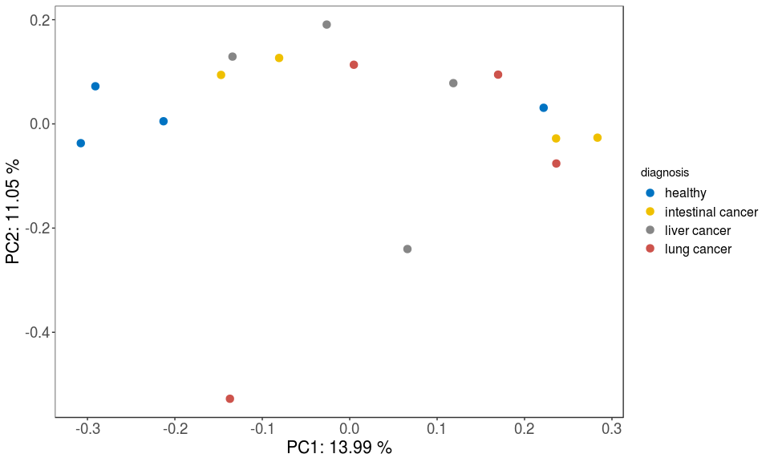
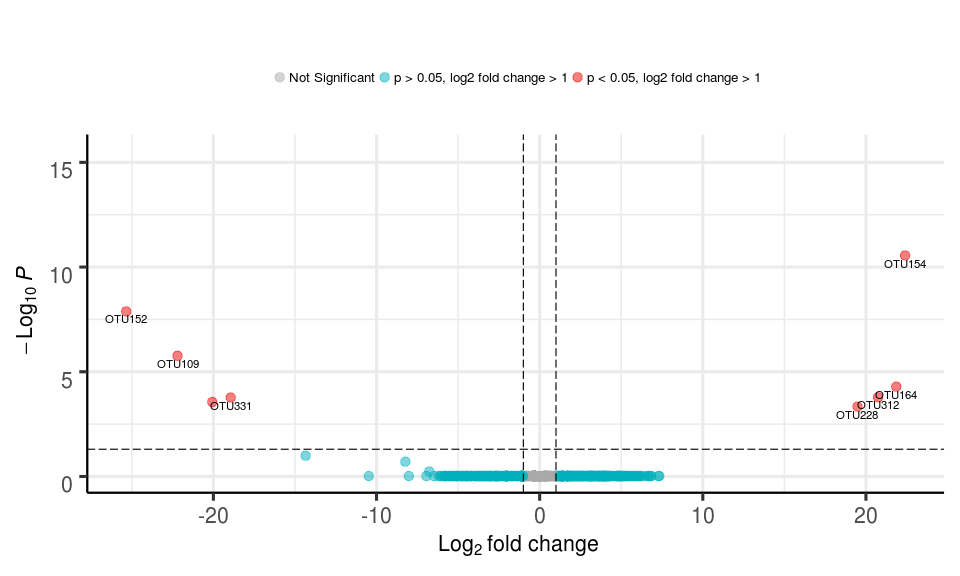

visualization416S package demo
================
yeguanhua

Install and load package
========================

Note:

You need to run install from the parent working directory that contains the 16S-analysis-visualization folder.

If you are can't install visualization416S package in R Console, try this: open 16S-analysis-visualization.Rproj first, then use RStudio → Build → Install and Restart.

``` r
devtools::install('16S-analysis-visualization')
```

``` r
rm(list = ls())
library(visualization416S)
demoPhyloseq <- visualization416S::demo_phyloseq_object
demoDADA2res <- visualization416S::demo_dada2_result
```

Data status
===========

1.  Primer: CCTAYGGGRBGCASCAG ; GGACTACNNGGGTATCTAAT

2.  DADA2 filter parameters: dada2::filterAndTrim(truncLen=c(0,0), maxEE=c(2,2))

3.  DADA2 taxonomy database: silva\_nr\_v132

4.  Metadata:

| subject\_id | diagnosis         |
|:------------|:------------------|
| s17118646   | intestinal cancer |
| s17118647   | liver cancer      |
| s17118650   | lung cancer       |
| s17118657   | healthy           |
| s17118661   | healthy           |
| s17118664   | intestinal cancer |
| s17118667   | healthy           |
| s17118669   | intestinal cancer |
| s17118680   | lung cancer       |
| s17118684   | liver cancer      |
| s17118686   | intestinal cancer |
| s17118691   | lung cancer       |
| s17118703   | lung cancer       |
| s17118714   | healthy           |
| s17118715   | liver cancer      |
| s17118730   | liver cancer      |

Track reads through DADA2 workflow
==================================

First use the reads track function to make sure there is no over-large drop associated with any single step in DADA2.

``` r
visualization416S::dada2_reads_track(demoDADA2res$reads_track, single_end = FALSE)
```


Stacked bar plot of phylogenetic composition
============================================

### Order level

``` r
visualization416S::stacked_bar_plot(phyloseq = demoPhyloseq, level = "Family", feature = "diagnosis")
```


Alpha diversity
===============

### Chao1

``` r
visualization416S::alpha_diversity_plot(phyloseq = demoPhyloseq, feature = "diagnosis", 
                                        measures = "Chao1", p_test = "kruskal")
```


Beta diversity
==============

### Bray-Curtis

``` r
visualization416S::beta_diversity_plot(phyloseq = demoPhyloseq, feature = "diagnosis", 
                                       method = "bray")
```



Log2 fold change
================

``` r
visualization416S::log2fc(phyloseq = demoPhyloseq, feature = "diagnosis")
```

    ##      OTU log2FoldChange         padj
    ## 1 OTU154       22.40152 2.806171e-11
    ## 4 OTU164       21.85581 5.133843e-05
    ## 5 OTU312       20.74025 1.658810e-04
    ## 8 OTU228       19.48117 4.637397e-04
    ## 6 OTU331      -18.93621 1.699453e-04
    ## 7 OTU282      -20.06961 2.784319e-04
    ## 3 OTU109      -22.19975 1.731358e-06
    ## 2 OTU152      -25.34458 1.312528e-08


