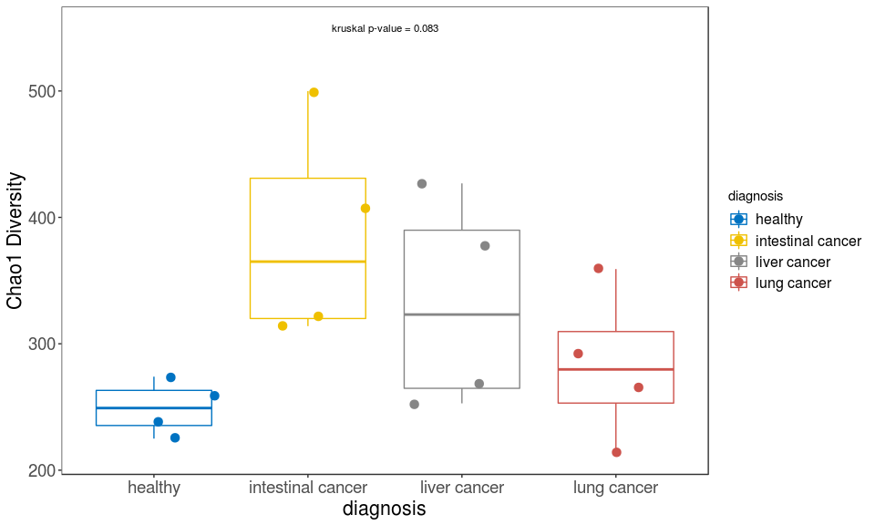

visualization416S package demo
================
yeguanhua

Install and load package
========================

Note:

You need to run install from the parent working directory that contains the visualization416S folder.

If you are can't install package in R Console, try this: open visualization416S.Rproj first, then use RStudio → Build → Install and Restart.

``` r
devtools::install('visualization416S')
```

Load package and demo data.

``` r
rm(list = ls())
library(visualization416S)
demoPhyloseq <- visualization416S::demo_phyloseq_object
demoDADA2res <- visualization416S::demo_dada2_result
```

Data status
===========

1.  Primer:

CCTAYGGGRBGCASCAG ; GGACTACNNGGGTATCTAAT

1.  DADA2 filter parameters:

dada2::filterAndTrim(truncLen=c(0,0), maxEE=c(2,2))

1.  DADA2 taxonomy database:

silva\_nr\_v132

1.  Metadata:

| subject\_id | diagnosis         |
|:------------|:------------------|
| s17118657   | healthy           |
| s17118661   | healthy           |
| s17118667   | healthy           |
| s17118714   | healthy           |
| s17118646   | intestinal cancer |
| s17118664   | intestinal cancer |
| s17118669   | intestinal cancer |
| s17118686   | intestinal cancer |
| s17118647   | liver cancer      |
| s17118684   | liver cancer      |
| s17118715   | liver cancer      |
| s17118730   | liver cancer      |
| s17118650   | lung cancer       |
| s17118680   | lung cancer       |
| s17118691   | lung cancer       |
| s17118703   | lung cancer       |

Track reads through DADA2 workflow
==================================

First use the dada2\_reads\_track function to check reads drop associated with every step in DADA2.

``` r
visualization416S::dada2_reads_track(demoDADA2res$reads_track, single_end = FALSE)
```


Stacked bar plot of phylogenetic composition
============================================

Use stacked\_bar\_plot function to plot the Order level abundance in every sample. You can change the 'level' argument to plot abundance in different level, or change the 'feature' to choose different feature you want to show in x-axis.

### Order level

``` r
visualization416S::stacked_bar_plot(phyloseq = demoPhyloseq, level = "Family", feature = "diagnosis")
```


Alpha diversity
===============

Use alpha\_diversity\_plot to plot alpha diversity. Change 'measures' argument to use different measurement.

### Chao1

``` r
visualization416S::alpha_diversity_plot(phyloseq = demoPhyloseq, feature = "diagnosis", 
                                        measures = "Chao1", p_test = "kruskal")
```



Beta diversity
==============

Use beta\_diversity\_plot to plot beta diversity. Change method to draw different beta diversity plot.

### Bray-Curtis

``` r
visualization416S::beta_diversity_plot(phyloseq = demoPhyloseq, feature = "diagnosis", method = "bray")
```


Log2 fold change
================

Use log2fc function to show differential analysis result.

``` r
visualization416S::log2fc(phyloseq = demoPhyloseq, feature = "diagnosis")
```

    ##      OTU log2FoldChange         padj
    ## 1 OTU154       22.40152 2.806171e-11
    ## 4 OTU164       21.85581 5.133843e-05
    ## 5 OTU312       20.74025 1.658810e-04
    ## 8 OTU228       19.48117 4.637397e-04
    ## 6 OTU331      -18.93621 1.699453e-04
    ## 7 OTU282      -20.06961 2.784319e-04
    ## 3 OTU109      -22.19975 1.731358e-06
    ## 2 OTU152      -25.34458 1.312528e-08


